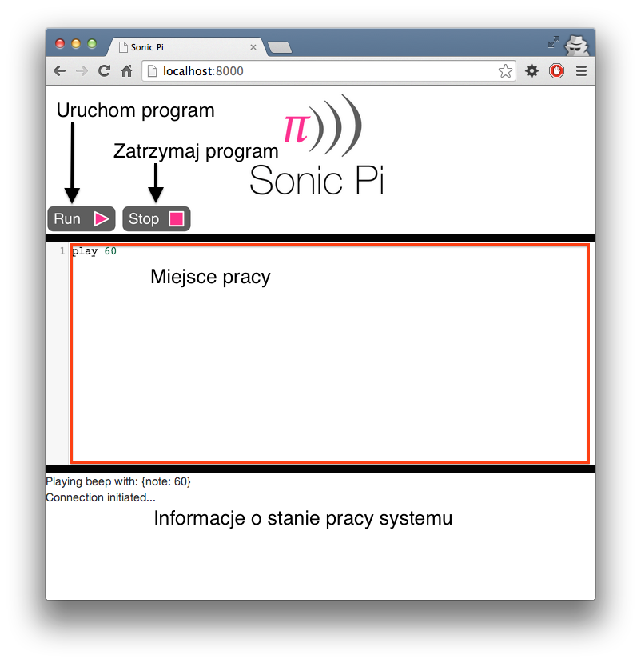

# Sonic Pi Instrukcje do zajęć


## Wstęp

[Sonic Pi](http://www.cl.cam.ac.uk/projects/raspberrypi/sonicpi/) jest językiem programowania przygotowanym przez doktora Sam'a Aaron'a. Jest to język zaprojektowany w celu nauczania konceptów programowania, poprzez proces tworzenia nowych dźwięków. Ta instrukcja wprowadzi Ciebie w świat programowania, pokaże Sonic-Pi i pozwoli tworzyć wiele niesamowitych melodii.

## Nauczycie się

W przeciągu kolejnych 100 minut nauczycie się:

- Jak pisać kod w postaci tekstowej, w celu wytworzenia muzyki
- Poznacie podstawowe aspekty programowania:
    - Sekwencja
    - Iteracja
    - Warunek
    - Funkcja
    - Zmienna

## Ściąga
W związku z tym, że programujemy po angielsku, słowa kluczowe także są w języku angielskim. Oto słownik podstawowych słów.

**Tłumaczenie składni na język polski**

| Składnia języka   | Znaczenie                |
|-------------------|--------------------------|
|play               |Graj                      |
|sleep              |Śpij                      |
|rand               |Wylosuj liczbę losową     |
|def                |Definiuj funkcję          |
|if                 |Jeżeli                    |
|else               |W przeciwnym wypadku      |
|end                |Zakończ                   |
|while              |Dopóki                    |
|5.times do         |Powtórz 5 razy            |


## Miejsce pracy
Aby rozpocząć zabawę należy otworzyć przeglądarkę internetową i przejść na stronę localhost:8000 .
Ukaże się następujące okno:



Znajdują się na nim kolejne elementy:
- Pole tekstowe, w którym będziemy pisali nasze programy
- Przycisk uruchamiający program
- Przycisk zatrzymujący program

Wpisz w polu tekstowym ```play 60```, oraz uruchom program. Jeśli w twoich słuchawka zagrała jedna nuta, oznacza to, że jesteś gotowy do zajęć.

## Nuty, nuty, nuty.
Wartość jaką wpisujesz za słowem 'play' reprezentuje nuty. W gruncie rzeczy to są numery MIDI (takie jak w telefonach 5 lat temu). Najciekawsze dźwięki znajdują się w przedziale od 20-120.
Jeżeli pamiętacie z lekcji muzyki, nuty oznaczaliśmy też symbolami. Oto mapowanie nut na wartości numeryczne:


# Scenariusz
Plan pracy jest podzielony na 8 kroków. Zanim zaczniemy, oto są podstawowe zasady programowania:
- Programujemy bez polskich znaków.
- Ważna jest składnia programu, którą poznacie stopniowo.
- Nie przejmujcie się błędami składni. Pytajcie odrazu, jeżeli coś nie działa.
- Używamy kropek, nie używamy przecinków w przypadku zapisywania liczb.
- Bądź kreatywny, nie podążaj sztywno, za przykładami w tej instrukcji. 


## Krok 1
W tym kroku poznasz jak używać komend graj(```play```) oraz śpij(```sleep```).  Poznajmy najpierw komendę graj.

- Wpisz w polu do edycji:
```ruby
play 60
```

- Wciśnij przycisk 'Run'. Co się wydarzyło ?

- Wróć do edytora i wpisz:
 ```ruby
 pley 60
 ```
To jest przykład błędu w programie. W dalszych ćwiczeniach, jeżeli popełnisz jakiś błąd lub literówkę, zostanie wyświetlony komunikat o błędzie.

- Przejdź teraz do edytora i wpisz
```ruby
play 60
play 58
play 56
```
Co się wydarzyło? Komputer gra każdą nutę w sekwencji, jedną po drugiej, ale dzieje się to tak szybko, że dla nas brzmi to tak, jakby to była jedna nuta.


- Musimy powiedzieć komputerowi, żeby poczekał przed odegraniem kolejnej nuty.
```ruby
play 60
sleep 0.5
play 58
sleep 0.5
play 56
```
Brzmi lepiej ? Widzimy tutaj już pewną zależność. Każda z funkcji: graj(```play```) oraz śpij(```sleep```) przyjmuje po jednym argumencie. Jest to liczba określająca zachowanie danej funkcji. Jeżeli piszemy ```sleep 0.5```, mówimy że jest to wywołanie funkcji sleep z argumentem 0.5. 


- Teraz jest czas, żebyście napisali sekwencję instrukcji tak, żeby zagrała ciekawy utwór.
Znając te dwie podstawowe operacje możecie napisać nastepujący utwór:
```ruby
play 67
sleep 0.4
play 64
sleep 0.4
play 64
sleep 0.4
play 65
sleep 0.4
play 62
sleep 0.4
play 62
sleep 0.4
play 60
sleep 0.4
play 64
sleep 0.4
play 67
```
Jaka to melodia ?

- W językach programowania istnieją komentarze. Komentarze mogą nam służyć, żeby opisać fragment kodu lub żeby powiedzieć komputerowi, żeby danego fragmentu nie wykonywał. Jak będzie brzmiała melodia, jeżeli uruchomicie ją w ten sposób:
```ruby
play 67
sleep 0.4
play 64
sleep 0.4
play 64
sleep 0.4
play 65
#sleep 0.4
#play 62
#sleep 0.4
#play 62
sleep 0.4
play 60
sleep 0.4
play 64
sleep 0.4
play 67
```

## Krok 2
Każdy komputer posiada możliwość wygenerowania losowej liczby. Jest to ciekawy element, który może urozmaicić naszą melodię.

- Napiszmy poniższy kod i uruchommy kilka razy. Co zaobserwowaliście ?
```ruby
play 67 + rand
sleep 0.4
play 64 + rand
```
Instrukcja rand zwraca wartość od 0 do 1. Dzięki czemu nasza nuta może przyjąć wartość albo 60 albo 61.

- Zauważyliśmy, że słabo słychać różnicę, jeżeli zmiana nuty jest tylko o jeden.
```ruby
play 67 + rand(10)
sleep 0.4
play 64 + rand(10)
```
Co teraz słyszycie ? Teraz zastanówmy się jak to działa. Wiemy, że funkcja ```rand``` zwraca wartość od 0 do 1. Wywołaniue funkcji ```rand(10)```, zwraca zatem liczbę od 0 do 10. Mówimy na to wywołanie funkcji rand z argumentem 10.
Po dodaniu do 67, możemy zagrać nutki od 67 do 77.

- Wykonajcie teraz trochę eksperymentów. Spróbujcie ułożyć zupełnie nową melodię z wykorzystaniem operacji rand.

## Krok 3
W poprzednim ćwiczeniu wielokrotnie losowaliśmy nową liczbę. Teraz poznajmy zmienne. Zmienna jest to miejsce do którego możemy przypisać pewną wartość. Wyobraźmy sobie, że jest to kubeczek,
który ma jakąś nazwę i możemy przypisać do niego pewną liczbę. Najtrudniejszą rzeczą w zmiennych jest ich nazewnictwo. Starajcie się wymyśleć dobre nazwy.

- Uruchomcie poniższy kod i zobaczcie co się stanie
```ruby
$nutka = 67
play $nutka
```
Zmienne oznaczamy przez znak $. Żeby przypisać wartość zmiennej do używamy znaku równości.

- Wykorzystajmy zatem zmienne w naszej melodii:
```ruby
$nutka = 67

play $nutka
sleep 0.4
play $nutka + 2
sleep 0.4
play $nutka + 4
sleep 0.4
play $nutka
```
Poznajecie tę melodię?  
  
- Zmieniliśmy jedną rzecz, w jakim celu to robimy? 
```ruby
$nutka = 67 - 12

play $nutka
sleep 0.4
play $nutka + 2
sleep 0.4
play $nutka + 4
sleep 0.4
play $nutka
``` 
Dzięki zastosowaniu zmiennych możemy np. zejść jedną oktawę wyżej lub niżej.
    
## Krok 4
W tym kroku nie poznamy żadnej nowej rzeczy, ale dokonamy powtórki tego, czego nauczyliśmy się do tej pory.

- Wyobraźmy sobie, że chcemy wylosować jedną liczbę i zagrać ją wielokrotnie. Możemy wykorzystać w tym celu zmienne.
```ruby
$nutka = 67 - rand(12)

play $nutka
sleep 0.4
play $nutka + 2
sleep 0.4
play $nutka + 4
sleep 0.4
play $nutka
```

- Możemy również wykorzystać zmienne, żeby ustawić stały przedział czasu między kolejnymi odtworzeniami nutek. Pozwoli nam to w prosty sposób zmieniać tempo utworu.
```ruby
$nutka = 67 - rand(12)
$pauza = rand(3)

play $nutka
sleep $pauza
play $nutka + 2
sleep $pauza
play $nutka + 4
sleep $pauza
play $nutka
```
Czy teraz muzyka brzmi za każdym razem inaczej ?

- Zmienną możemy również nadpisać. Wyobraźmy sobie, że nagle chcemy zmienić tempo w swoim utworze.
```ruby
$nutka = 67 - rand(12)
$pauza = rand(3)

play $nutka
sleep $pauza
play $nutka + 2
sleep $pauza
play $nutka + 4
sleep $pauza
play $nutka

$pauza = 0.2

play $nutka
sleep $pauza
play $nutka + 2
sleep $pauza
play $nutka + 4
sleep $pauza
play $nutka
```
Jak teraz zachowuje się nasz program ?

- Zmienne możemy również nadpisać na podstawie poprzedniej wartości. Możemy powiedzieć zwiększ obecną wartość zmiennej o 1. Używamy w tym celu operatora ```+=```. Wygląda to tak:
```ruby
$nutka = 67 - rand(12)
$pauza = rand

play $nutka
sleep $pauza
play $nutka + 2
sleep $pauza
play $nutka + 4
sleep $pauza
play $nutka

$pauza += 1 
#Oznacza to samo co $pauza = $pauza + 1  

play $nutka
sleep $pauza
play $nutka + 2
sleep $pauza
play $nutka + 4
sleep $pauza
play $nutka
```
Czy program zachowuje się dokładnie tak samo jak poprzednio ?

## Krok 5
Kolejnym elementem niezbędnym podczas programowania są funkcje. Funkcje enkapsulują wiele linii kodu (definicja funkcji) do jednej linijki(wywołanie fukcji). 

- Oto definicja funkcji:
```
def <nazwa_funkcji>(<argument funkcji>)
    <instrukcje funkcji>
end

<nazwa_funkcji> <wartość argumentu funkcji>
```

- Oto w jaki sposób działają funkcje:
```
- Program dochodzi do miejsca zwanym "wywołaniem funkcji".
- Program uruchamia funkcje, zaczynając od pierwszej linijki kodu funkcji.
- Program wykonuje wszystkie instrukcje od początku do końca.
- Program kończy wykonanie funkcji i wraca tam, z kąd funkcja została wywołana.
```

- Argumenty wejściowe funkcji służą zmianie zachowania danej funkcji. Ta sama funkcja wywołana z innym parametrem będzie brzmiała inaczej. 
Funkcja może mieć dowolną ilość argumentów, ale też może nie mieć ich wcale.


- Zagrajmy zatem następujący przykład:
```ruby
def jan(nutka)
  play nutka
  sleep 0.4
  play nutka + 2
  sleep 0.4
  play nutka + 4
  sleep 0.4
  play nutka
end

jan(67)
```

- Używając definicji tej funkcji możemy napisać np. dwie zwrotki swojego utworu:
```ruby
jan(67)
sleep(0.5)
jan(67-12)
sleep(0.5)
jan(67+12)
```

- Wróćmy zatem do pierwszego przykładu i zobaczmy jak możemy go sobie uprościć:
```ruby
def sleepPlay(note)
  play note
  sleep 0.4
end  

sleepPlay 67
sleepPlay 64
sleepPlay 64
sleepPlay 65
sleepPlay 62
sleepPlay 62
sleepPlay 60
sleepPlay 64
sleepPlay 67
```
Używajcie funkcji wszędzie tam, gdzie mogą one uprościć kod programu !

## Krok 6
Pętle są to podstawowe narzędzia programistyczne. Uwalniają nas od pisania tego samego kodu wiele razy. Wyobraźmy sobie, że chcemy zagrać 15 takich samych nutek. Dzięki pętli możemy powiedzieć komputerowi, wykonaj 10 razy pewien kawałek programu.

- Struktura pętli jest następująca
```
X.times do
  <instrukcje pętli>
end
```
Musimy określić dwie rzeczy. Pierwsza to jest ile razy chcemy powtórzyć dany fragment kodu. Określa to sekcja ```X.times```, gdzie X jest liczbą powtórzeń.
Druga to jest jaki fragment kodu chcemy powtórzyć. Ten fragment kodu znajduje się pomiędzy ```do``` oraz ```end```.

- Oto w jaki sposób program zostanie wykonany:
```
- Program dochodzi do początku funkcji.
- Program sprawdza ile razy wykonał już daną funkcję, oraz zastanawia się czy wykonał już zawartość funkcji wystarczającą ilość razy.
- Program wykonuje wszystkie instrukcje od początku do końca znajdujące się w ciele funkcji.
- Program kończy wykonanie funkcji jeżeli wykonał ją odpowiednią ilość razy.
```

- Spójrzcie na ten przykład
```ruby
play 60
sleep 0.5
play 60
sleep 0.5
play 60
sleep 0.5
```
Napisaliśmy jedną i tę samą operację 3 razy. Możemy tego uniknąć. Wystarczy, że użyjemy pętli.

- Poniżej znajduje program, którego melodia będzie dokładnie taka sama. Określiliśmy, że pętla ma się wykonać 3 razy oraz przekazaliśmy blok kodu do wykonania.
```ruby
3.times do
  play 60
  sleep 0.5
end
```

- Połączmy teraz to czego się nauczyliśmy. Możemy teraz zaprogramować komputer tak, aby zagrał nam szereg nut. Wcześniej mogliśmy to zrobić wypisując wszystkie nuty po kolei, co było by nużące. Teraz możemy użyć ciekawych konstrukcji.
```ruby
$nuta = 60
$przerwa = 0.5

10.times do
  play $nuta
  sleep $przerwa
  $nuta += 1
  $przerwa +=0.1
end
```

- Dodatkowo możemy użyć jeszcze funkcji:
```ruby
def sleepPlay(nuta, przerwa)
    play nuta
    sleep przerwa
end

$nuta = 80
$przerwa = 0.1

10.times do
  sleepPlay($nuta, $przerwa)
  $nuta += 1
  $przerwa +=0.1
end
```
W tym przykładzie wykorzystaliśmy już bardzo dużo elementów programowania. Użyliśmy pętli oraz zmiennych. Po eksperymentujcie teraz sami i spróbujcie ułożyć jakąś melodię.


## Krok 7
Instrukcje warunkowe to bardzo potężny i wszędzie używany element programowania. Instrukcja warunkowa składa się z trzech elementów:
```
- Testu logicznego.
- Bloku kodu do wykonania w przypadku gdy ten test jest prawdziwy.
```

Struktura instrukcji wygląda następująco:
```
if <warunek logiczny do sprawdzenia>
  <blok kodu do wykonania jeżeli prawda>
end
```

- Prosty przykład demonstrujący zachowanie instrukcji warunkowej:

```ruby
if rand < 0.5
  play 60
end
```

- Zobaczmy jak możemy to użyć w szerszym programie
```ruby
10.times do
  sleepPlay($nuta, $przerwa)
  $nuta += 1
  if $przerwa < 1
    $przerwa +=0.1
  end
end
```
Program ten stopniowo będzie zwiększał odległość miedzy nutami, do póki ta przerwa nie będzie mniejsza równa 1. Potem przerwa będzie taka sama.


## Krok 8
Pętla while, jest to bardziej rozbudowana forma pętli. W poprzednim rodzaju pętli mówiliśmy ile razy ma się wykonać jakaś czynność. Tutaj możemy określić warunek stopu wykonywania danej pętli.
```
while <warunek logiczny do sprawdzenia>
  <blok kodu do wykonania w pętli>
end
```

- Oto w jaki sposób program zostanie wykonany:
```
- Program dochodzi do początku pętli.
- Program sprawdza sprawdz czy warunek logiczny jest spełniony, jeżeli tak wykona ten blok kodu.
- Program wykonuje wszystkie instrukcje od początku do końca znajdujące się w ciele pętli.
- Program kończy wykonanie wywołanie pętli w momencie kiedy warunek logiczny przestanie być prawdą.
```

- Wyobraźmy sobie, że chcemy zagrać wszystkie nuty, dopóki nie dojdziemy do 90 nuty. Mówimy wtedy, że powtarzaj czynności dopóki nuta jest mniejsza niż 90.
 Musimy też pamiętać o tym, żeby w każdym przebiegu pętli nuta była o jeden stopień wyższa.


```ruby
$nuta = 60

while $nuta < 90
  sleepPlay($nuta, $przerwa)
  $nuta += 1
end
```

- Możemy teraz użyć naszej funkcji 'jan', żeby zagrać tę melodię z każdym przebiegiem pętli o ton wyżej.

```ruby
$nuta = 60

while $nuta < 90
  jan($nuta)
  sleep 0.5
  $nuta += 1
end
```

#Zakończenie
To jest wszystko co dla was przygotowałem.
Poznaliście dzisiaj najważniejsze koncepty programowania. Jeżeli temat was interesuje, używając wyszukiwarki, znajdziecie wiele ciekawych piosenek, napisanych w Sonic-Pi. Przeanalizujcie kod programu, zmodyfikujcie go i twórzcie w ten sposób muzykę.
 
Poznaliście tylko wierzchołek góry lodowej programowania oraz Sonic-Pi. W Sonic-Pi możecie na przykład za pomocą ```use_synth "saw_beep"``` zmieniać rodzaj instrumentu. Możemy też za pomocą wątków ```in_thread```symulować wiele instrumentów.


# Przykłady

Wlazł kotek na płotek:
```ruby
$krok = 0

4.times do
  play 67
  sleep 0.4
  play 64
  sleep 0.4
  play 64
  sleep 0.4
  play 65
  sleep 0.4
  play 62
  sleep 0.4
  play 62
  sleep 0.4
  play 60
  sleep 0.4
  play 64
  sleep 0.4
  if $note % 2 == 0
    play 67
  else
    play 60
  end
  $note += 1
  sleep 1
end
```